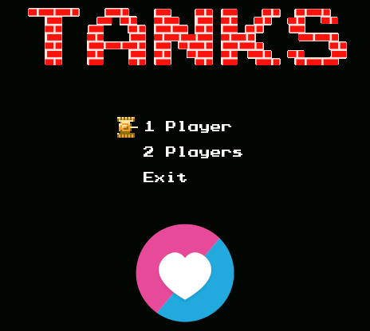

# LÖVE Battle City
Welcome to the Battle City Clone project! This is a personal take on recreating the classic tank shooter game, built using the [LÖVE](https://love2d.org) framework for 2D game development. Inspired by the original gameplay and mechanics, this project brings nostalgic action and strategy in a modernized environment.

This project draws significant inspiration from an excellent repository that served as a foundation and guide during development([Link](https://github.com/krystiankaluzny/Tanks)) Feel free to explore, modify, or expand upon this clone as part of your own learning journey or game development passion.

## Screenshots

## Controls
|     Key       | Action        |
| ------------- | ------------- |
| left          | player1 moves left  |
| right         | player1 moves right |
| up            | player1 moves up    |
| down          | player1 moves down     |
| k             | player1 fires       |
| a          | player2 moves left     |
| d          | player2 moves right |
| w         | player2 moves up |
| s             | player2 moves down |
| g             | player2 fires |
| n           | go to next level |
| p           | go to previous level |
| ESC           | app quits |
